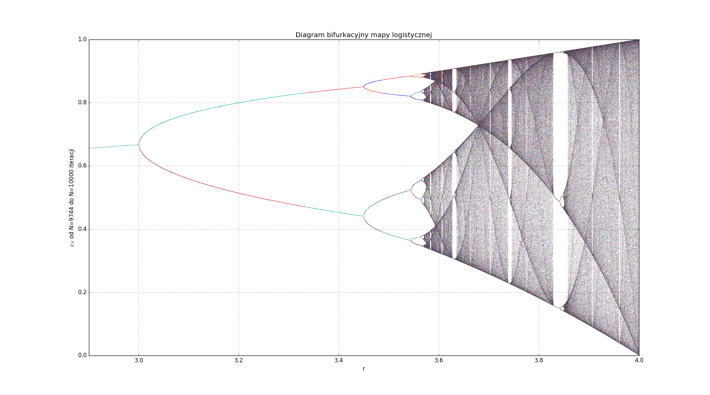

# Bardzo dobre pytania z DUN
### Bardzo subiektywny przegląd made by Dominik Stańczak

WX SY oznacza wykład X slajd Y

### "Rozgrzewka"
* Jakie są zastosowania DUN?
* Jak wygląda diagram bifurkacyjny odwzorowania logistycznego?
* Układ dynamiczny. Jak to rozumieją DUNowcy? Czy może być stochastyczny?
* Skąd wyrosły obecne DUNy? (3)
* Co znaczy że układ jest ergodyczny?
* Mapa Bernoulliego i orbity 2-periodyczne a przesunięcie Bernoulliego (ciąg binarny). Jak to działa?
* Wykładnik Lyapunova, ścisłe wyrażenie nań, warto umieć wyprowadzić. Jaki jest sens tegoż?
 $$\lambda(x_0) = \lim_{N \to \infty} \sum_{i=0}^{N-1} \ln{|f'(x_i)|}$$
* Kiedy punkt stały jest stabilny, a kiedy jedynie lokalnie stabilny?
* Gęstość niezmiennicza. Jak *wygląda* jej wykres? Czym się różni od zwykłej gęstości dla jakiegoś odwzorowania?
* Odwzorowanie logistyczne - gdzie możnaby je zastosować?
* Czemu $r = 4$ dla logistycznego jest takie magiczne? *(podpowiedź: co robi z odcinkiem $(0, 1)$?)*
* Basen atrakcji. Czym jest? Jak wygląda dla jakiegoś dowolnego odwzorowania które ma dwa punkty stabilne?
* Bifurkacja podwajania okresu. Jak działa?

### Konkretne
* Jak sprawdzić, czy szum (szereg czasowy) jest deterministyczny, czy jednak losowy?
* Czym są okna periodyczne?
* W2 S2 pytanie o chaotyczność układu wahadła z tłumieniem, odpowiedź z wykładu: czas jest parametrem więc mamy trzy równania. Gdzie tu jest błąd? :) <a href="https://en.wikipedia.org/wiki/Poincar%C3%A9%E2%80%93Bendixson_theorem">Podpowiedź</a>
* Przekrój Poincare, JJŻ mówił o trudnych przypadkach z geometrią. Czy nie idzie po prostu wykombinować macierzy zmiany bazy, walnąć nią nasze wektory stanu i plotnąć przecięcia z $x'=0$ ?
* Mieszanie topologiczne, czemu jest warunkiem koniecznym na chaos? Przykład: Ciąg $x_{n+1} = 2 x_n$. Czy spełnia warunek że dwa początkowe punkty się od siebie wykładniczo oddalają? Czy mimo tego jest chaotyczny?
* W2 S9 odległość od punktu stałego a związek z Lypaunovem
* Jak zweryfikować następujące, W2 S12?
 >"Układ jest ergodyczny jesli miara niezmiennicza nie zależy od warunku początkowego."

* <a href="http://mathworld.wolfram.com/Frobenius-PerronEquation.html">Operator Frobenius-Perona</a>. Czy da się go narysować, policzyć numerycznie?
* **Miara niezmiennicza** (nie gęstość!) - czy chodzi o podejście "od tyłu" do iteracji, w sytuacji gdzie wchodząc w głąb iteracji branchujemy się na fraktalne rozejścia?
$$\mu(S) = \mu(f^{-1} (S))$$
* W3 S7, bifurkacje - rozkminić programami jak to wygląda, przerobić te przykłady
* Korzystając z wykresu diagramu bifurkacyjnego, jaki maksymalny okres orbity występuje w logistycznym dla $r=3.1$, $r=3.4$, $r=3.5$, $r = 3.567$ ? *(ostatnie jest podchwytliwe)*

* Przypomnij sobie rysunek z definicji wykładnika Lyapunova - rozciągający\kurczący się odcinek między dwoma punktami zaczynającymi blisko siebie. Narysuj podobny rysunek, gdy $r=r_{ms}$, dla orbity superstabilnej.
